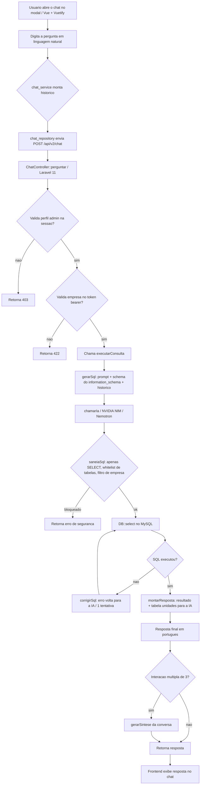

# Marcolub - Chat com Inteligencia Artificial para consultas em banco de dados de lubrificacao industrial

Solucao aplicada em um sistema real (em producao) da **Marcolub**, empresa de lubrificacao industrial, cliente do autor deste projeto. Por esse motivo, o codigo fonte completo da aplicacao nao pode ser disponibilizado publicamente. O que se compartilha aqui e o **ChatController.php**, o componente mais relevante da solucao (o nucleo do chat com IA no backend), junto com a explicacao da arquitetura completa: frontend, backend e banco de dados MySQL.

Video demonstrativo: [https://canva.link/7p89dt83lie7mb1](https://canva.link/7p89dt83lie7mb1)

## Visao geral da solucao

O sistema eh um ERP gerencial de Ordens de Servico (OS) de lubrificacao industrial. Dentro do painel administrativo, foi adicionado um chat que responde, em portugues do Brasil, perguntas sobre os dados operacionais da empresa, por exemplo:

- Quantos equipamentos tenho na empresa?
- Quantos pontos de lubrificacao existem?
- Quantas ordens de servico foram realizadas esta semana?
- Qual area consumiu mais oleo no mes?
- Quanto de graxa foi retirado via requisicoes de material?

O usuario nao digita SQL. O chat entende a pergunta em linguagem natural, gera dinamicamente o comando SQL, executa somente leitura no banco real, interpreta o resultado e responde de forma objetiva. A cada tres interacoes, o chat gera uma sintese da conversa exibida em um painel lateral.

## Arquitetura

### Frontend (Vue 3 + Vuetify)

O modulo `chat` do frontend ficou responsavel por:

- **Modal global**: o chat funciona como um modal sobre o sistema, acessivel apenas pelo menu "Chat" no sidebar (visivel somente para o perfil administrador).
- **Interface de conversa**: historico de perguntas e respostas e campo de entrada com estado de "enviando".
- **Painel lateral de sinteses**: agrupadas por numero de interacao (3a, 6a, 9a...).
- **Servico, repositorio e DTO**: camadas separadas (`chat_service`, `chat_repository`, `chat_dto`), seguindo o padrao do restante do projeto.
- **Chave de API de fallback**: campo mascarado (nao exibe o texto digitado), armazenado apenas em `sessionStorage`, enviado ao backend no header `X-Ia-Fallback-Api-Key`. Nao fica gravado em banco nem em formularios.
- Toda chamada usa o token de autenticacao da sessa.o logada.

Fluxo no frontend:

1. O usuario digita a pergunta no modal.
2. O servico monta o historico de interacoes anteriores (pergunta/resposta).
3. O repositorio envia `POST /api/v2/chat` com o corpo `{ pergunta, historico }`.
4. A resposta JSON `{ resposta, sintese, sql }` e exibida no modal; a sintese, quando presente, vai para o painel lateral.

### Backend (Laravel 11)

O backend expoe a rota `POST /api/v2/chat`, tratada pelo `ChatController` (arquivo anexado). Principais responsabilidades:

- **Seguranca de acesso**: somente o perfil `admin` (obtido da sessao autenticada do Laravel) tem permissao. A empresa do usuario tambem e validada a partir do token bearer da aplicacao, garantindo que as consultas sejam restritas a empresa da sessao.
- **Geracao de SQL por IA**: um prompt com o schema (nomes exatos de tabelas e colunas), regras de negocio e exemplos few-shot convence o modelo a gerar apenas `SELECT`.
- **Schema dinamico**: o prompt e montado em tempo de execucao consultando `information_schema`, entao o modelo sempre conhece o banco real, sem manutencao manual.
- **Sanitizacao obrigatoria** (`saneiaSql`): toda query gerada pela IA passa por validacoes:
  - somente comandos `SELECT`;
  - bloqueio de comentarios, ponto-e-virgula multiplo, `information_schema`, `INTO OUTFILE`, `LOAD_FILE` e palavras-chave perigosas (`INSERT`, `UPDATE`, `DELETE`, `DROP`, `ALTER`, `CREATE`, `TRUNCATE`, `GRANT`, `REVOKE`, `RENAME`, `REPLACE`, `CALL`, `EXECUTE`);
  - whitelist de tabelas: apenas as tabelas de negocio estao no escopo (sessoes, usuarios, parametros, permissoes, menus e tabelas de infra/cache/phpMyAdmin ficam bloqueadas);
  - obrigatoriedade do filtro de empresa (`{{ID_EMPRESA}}`) quando a tabela possui coluna de empresa;
  - padronizacao dos nomes reais das tabelas (maiusculas/minusculas corretas, ex.: `processamentoPonto`).
- **Correcao automatica**: se o SQL falhar no banco, o erro e enviado de volta a IA para uma tentativa unica de correcao antes de devolver falha.
- **Montagem da resposta**: o resultado bruto (e o conteudo completo da tabela `unidades`, usada nas conversoes) e enviado a IA para produzir a resposta final em portugues, explicando numeros, areas, equipamentos e unidades.
- **Sintese**: a cada 3 interacoes o backend chama a IA para resumir a conversa; falhas de sintese nao derrubam a resposta da pergunta.
- **Provedor de IA**: usa a API gratuita da NVIDIA NIM (endpoint OpenAI-compatible `integrate.api.nvidia.com`), priorizando o modelo `nvidia/nemotron-3-super-120b-a12b`, com alternativa `nvidia/llama-3.3-nemotron-super-49b-v1.5` e tentativas em rodadas. A geracao forca saida JSON (`response_format json_object`, com retry sem ele se o modelo nao suportar). Nenhuma chave da Google e mais utilizada.
- **Chaves de API**: lidas de `NVIDIA_API_KEY` no `.env` do servidor; a chave de fallback do frontend e usada como segunda opcao quando a principal falha.

Fluxo no backend:

1. Valida perfil `admin` na sessao e empresa no token bearer.
2. Monta o historico e chama `gerarSql` (IA + schema dinamico + regras de negocio).
3. Sanitiza o SQL gerado (`saneiaSql`).
4. Executa no MySQL com `DB::select`.
5. Em erro de execucao, uma rodada de `corrigirSql` e tentada.
6. `montarResposta` converte o resultado em texto com a IA.
7. Se for a 3a, 6a, 9a... interacao, gera a `sintese`.
8. Retorna `{ resposta, sintese, sql }`.

Variaveis de ambiente:

| Variavel | Descricao |
| --- | --- |
| `NVIDIA_API_KEY` | Chave gratuita da NVIDIA NIM (obtida em build.nvidia.com) |
| `NVIDIA_MODEL` | Modelo padrao (opcional; padrao: `nvidia/nemotron-3-super-120b-a12b`) |
| `X-Ia-Fallback-Api-Key` (header) | Chave de fallback enviada pelo frontend quando a principal falha |

### Banco de dados (MySQL)

- **Somente leitura**: a aplicacao usa `DB::select`, apenas consultas.
- **Escopo de tabelas**: 20 tabelas de negocio, incluindo `os`, `pontos`, `conjuntos`, `equipamentos`, `areas`, `lubrificantes`, `unidades`, `requisicoes`, `roteiros`, `anomalias`, `gestores`, `empresas`, entre outras.
- **Tabelas bloqueadas**: `Sessoes`, `sessions`, `users`, `usuarios`, `menus`, `menu_perfil`, `perfis`, `permissoes`, `parametros`, `contextoParametro`, `TipoToken`, `TokenRedefinir`, `cache*`, `jobs*`, `migrations`, `failed_jobs`, `password_reset_tokens`, `xevents`, `pma__*` e tabelas temporarias de migracao.
- **Schema dinamico**: o prompt usa `information_schema` para listar as colunas reais, entao qualquer mudanca de banco e refletida automaticamente no chat.
- **Regras de negocio embutidas no prompt**:
  - OS executada/baixada = `os.dataExecutada IS NOT NULL`;
  - consumo por OS = `pontos.quantidade * pontos.NumeroPontos`, na unidade `pontos.idUnidade`;
  - conversao de unidades: o banco grava a menor unidade (ml/mg); litros = valor * fator / 1000 (fator 1000 para `L`/`KG`, fator 1 para `ML`/`GR`);
  - `os.retornoQuantidade` nao e consumo (e medicao pos-servico);
  - requisicoes de material (`requisicoes.volume`) tambem representam consumo real.

## Fluxo ilustrado (diagrama)

O codigo Mermaid do fluxo completo esta no arquivo `fluxo.mmd` deste repositorio (e tambem logo abaixo, pronto para colar no README).

## Limites e consideracoes

- Projeto real de cliente: apenas o `ChatController.php` esta publico; frontend e demais controllers nao.
- A solucao prioriza provedor gratuito (NVIDIA NIM) com qualidade "boa o suficiente" para geracao de SQL estruturada; para maior qualidade de linguagem, basta trocar a configuracao do modelo.
- Todas as regras de seguranca sao aplicadas no backend; o frontend apenas apresenta a interface.

## Licenca

Codigo compartilhado para fins didaticos e de referencia. O autor e a Marcolub nao se responsabilizam pelo uso em outros ambientes; adapte regras de negocio e validacoes ao seu dominio.